<h1 align="center">𝑲𝒆𝒗𝒊𝒏 𝑺𝒂𝒏𝒕𝒂𝒏𝒂 𝒅𝒐𝒔 𝑹𝒆𝒊𝒔</h1>

<h3 align="center">Desenvolvedor Full Stack</h3>

  

  
  

  Construindo soluções web com foco em back-end, APIs, bancos de dados e experiências digitais bem estruturadas.

  
  

---

## Sobre mim

- Desenvolvedor Full Stack.
- Graduando em Análise e Desenvolvimento de Sistemas no UNASP.
- Formação técnica em Tecnologia da Informação.
- Interesse em back-end, APIs, bancos de dados e desenvolvimento web.
- Localizado em Hortolândia, São Paulo, Brasil.
- Em evolução contínua por meio de projetos práticos e estudos técnicos.

 

## Projetos em destaque

### Prismivo

Plataforma SaaS full stack para operações de empresas de serviços, com autenticação, organizações, clientes, equipe, projetos, aprovações, atendimento, notificações, painel administrativo e controle de acesso por funções. Construída com persistência PostgreSQL, políticas RLS, internacionalização e testes automatizados.

[Acessar o Prismivo](https://prismivo.kevinsantanadev.com.br) · [Ver código](https://github.com/kevinsantanadev/prismivo)

### VagaTrack

Plataforma full stack para gestão de candidaturas e processos seletivos, com dashboard, banco de dados persistente, filtros, relatórios e integração de localização por API.

[Ver demonstração do VagaTrack](https://vagatrack.kevinsantanadev.com.br)

### ImunoLink

Plataforma digital para gestão de vacinas e perfis de saúde desenvolvida em uma equipe de duas pessoas. Atuação principal no back-end, com contribuições full stack em regras de negócio, banco de dados, integrações e validações.

[Conhecer o ImunoLink](https://projetomed.com.br/TECTI/2025/gp02/imunolink/app/index.php)

### Portfólio

Portfólio multilíngue com temas claro e escuro, acessibilidade, animações sutis e experiência 3D interativa.

[Abrir portfólio](https://kevinsantanadev.com.br) · [Ver código](https://github.com/kevinsantanadev/portfolio)

## Tecnologias e ferramentas

### Linguagens

  
  
  
  
  
  
  

### Frameworks e bibliotecas

  
  
  
  
  
  
  
  
  

### Bancos de dados e serviços

  
  
  
  
  
  
  
  
  
  
  

### Ferramentas de desenvolvimento

  
  
  
  
  
  
  
  
  
  

 

## Estatísticas do GitHub

  
  

  

  

  Estatísticas geradas e atualizadas automaticamente pelo próprio repositório.

## Atualmente estudando

- Autenticação e separação segura de dados.
- Dashboards, indicadores e relatórios.
- APIs REST e integrações externas.
- Interfaces responsivas e acessibilidade.
- Versionamento e boas práticas com Git e GitHub.

---

  Aberto a oportunidades, colaboração e novos desafios em desenvolvimento de software.

## Direitos autorais

© 2026 Kevin Santana dos Reis. Todos os direitos reservados.

Este perfil é público para apresentação profissional, avaliação e estudo pessoal. O conteúdo não é open source e não pode ser copiado, redistribuído ou apresentado como criação de terceiros.

Consulte o arquivo [LICENSE.md](LICENSE.md) para conhecer as condições de uso.
